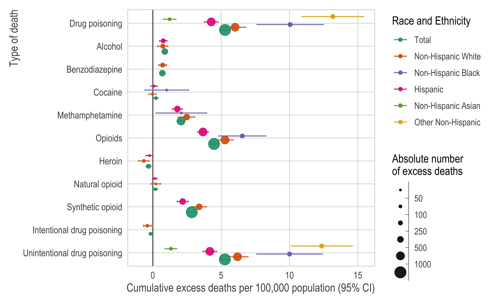

<!-- README.md is generated from README.Rmd. Please edit that file -->

# Excess fatal drug overdoses in California during the COVID-19 pandemic by race/ethnicity, educational attainment, and region: A population-based study

This is reproducible code for our paper, “[Excess fatal drug overdoses
in California during the COVID-19 pandemic by race/ethnicity,
educational attainment, and region: A population-based
study](https://www.thelancet.com/journals/lanam/article/PIIS2667-193X(22)00054-0/fulltext)”
in *The Lancet Regional Health - Americas*. The full citation is:

> Kiang MV, Acosta RJ, Chen Y-H, Matthay EC, Tsai AC, Basu S, Glymour
> MM, Bibbins-Domingo K, Humphreys K, Arthur KN, “Sociodemographic and
> geographic disparities in excess fatal drug overdoses during the
> COVID-19 pandemic in California: a population-based study.” *The
> Lancet Regional Health - Americas*. 2022 Jul;11:100237. doi:
> [10.1016/j.lana.2022.100237](https://www.thelancet.com/journals/lanam/article/PIIS2667-193X(22)00054-0/fulltext).
> Epub 2022 Mar 19. PubMed PMID: 35342895; PubMed Central PMCID:
> PMC8934030.

## Abstract

**Background.** The coronavirus disease 2019 (COVID-19) pandemic is
co-occurring with a drug addiction and overdose crisis.

**Methods.** We fit overdispersed Poisson models to estimate the excess
fatal drug overdoses (i.e., deaths greater than expected), using data on
all deaths in California from 2016 through 2020.

**Findings.** Between January 5, 2020 and December 26, 2020, there were
8,605 fatal drug overdoses—a 44% increase over the same period one year
prior. We estimated 2,084 (95% CI: 1,925 to 2,243) fatal drug overdoses
were excess deaths, representing 5·28 (4·88 to 5·68) excess fatal drug
overdoses per 100,000 population. Excess fatal drug overdoses were
driven by opioids, especially synthetic opioids. The non-Hispanic Black
and Other non-Hispanic populations were disproportionately affected with
10·1 and 13·26 excess fatal drug overdoses per 100,000 population,
respectively, compared to 5·99 per 100,000 population in the
non-Hispanic white population. There was a steep, nonlinear educational
gradient with the highest rate among those with only a high school
degree. There was a strong spatial patterning with the highest levels of
excess mortality in the southernmost region and consistent decreases at
more northern latitudes (7·73 vs 1·96 per 100,000).

**Interpretation.** Fatal drug overdoses disproportionately increased in
2020 among structurally marginalized populations and showed a strong
geographic gradient. Local, tailored public health interventions are
urgently needed to reduce growing inequities in overdose deaths.

## Issues

Please submit issues [via
Github](https://github.com/mkiang/excess_drug_overdoses/issues) or via
email.

## Important note about reproducibility

In accordance with our data use agreement with the California Department
of Public Health - Vital Statistics, we cannot share decedent-level data
required to fully reproduce our results. To run the code from start to
finish, you must request restricted-access data from CDPH. (See
*Requirements*.) When allowed by our DUA, we share aggregated data on
this repo and the numeric representation of all figures (`./output`).

# Requirements

## Restricted-access death certificate level data

You can request the decedent-level microdata from CDPH using the [Vital
Stats](https://www.cdph.ca.gov/Programs/CHSI/Pages/Data-and-Statistics-.aspx)
website.

## Software

All analyses are conducted using `R`, which can be [downloaded via
CRAN](https://cran.r-project.org/). We also recommend the use of
[RStudio](https://www.rstudio.com/products/rstudio/download/) when
running `R`, which will allow users to take advantage of
[`renv`](https://rstudio.github.io/renv/index.html) for dependency
management.

One supplemental analysis requires using the Joinpoint Regression
Program, which can be [downloaded from the National Cancer
Institute](https://surveillance.cancer.gov/joinpoint/).

# Analysis pipeline

-   `code`: The scripts in `./code` are designed to be run in order. The
    header of all analytic files provide a brief description. Some files
    are quite long so it is suggested you use RStudio’s Document Outline
    feature (CMD + SHIFT + O on macOS).
-   `config.yml`: Contains all the configuration information including
    the starting and ending dates for the predictions as well as the
    location of the raw and processed files on the secure compute
    environment.
-   `data`: All data after it has been processed and aggregated.
-   `data_private`: Data that cannot be publicly shared (not on Github).
-   `data_raw`: Publicly available raw data from the US Census.
-   `joinpoint`: Contains files necessary to replicate our sensitivity
    analysis using joinpoint regression.
-   `output`: The numerical representation of all figures in csv format.
-   `plots`: All figures in the manuscript and supplement.
-   `renv`: Files necessary to load the same `R` packages we used in our
    analysis.
-   `rmds`: Rmarkdown files such as supplemental tables.

# Session information

See `./session_info.txt` for more reproducibility information.

# Authors (alphabetical)

-   [Rolando Acosta](https://rjacosta.netlify.app)
    (:
    [RJNunez](https://github.com/RJNunez) \|
    :
    [@RJANunez](https://twitter.com/RJANunez))
-   Kristen Arthur
-   [Sanjay
    Basu](https://sites.google.com/stanford.edu/basulab/home?authuser=0)
    (:
    [sanjaybasu](https://github.com/sanjaybasu) \|
    :
    [@sanjaybmdphd](https://twitter.com/sanjaybmdphd))
-   [Kirsten
    Bibbins-Domingo](https://profiles.ucsf.edu/kirsten.bibbins-domingo)
    (:
    [@KBibbinsDomingo](https://twitter.com/KBibbinsDomingo))
-   [Yea-Hung Chen](https://yea-hung.rbind.io)
    (:
    [yea-hung](https://github.com/yea-hung) \|
    :
    [@ch272n](https://twitter.com/ch272n))
-   [Maria Glymour](https://profiles.ucsf.edu/maria.glymour)
    (:
    [@MariaGlymour](https://twitter.com/MariaGlymour))
-   [Keith Humphreys](https://profiles.stanford.edu/keith-humphreys)
    (:
    [@KeithNHumphreys](https://twitter.com/KeithNHumphreys))
-   [Mathew Kiang](https://mathewkiang.com)
    (:
    [mkiang](https://github.com/mkiang) \|
    :
    [@mathewkiang](https://twitter.com/mathewkiang))
-   [Ellicott Matthay](https://profiles.ucsf.edu/ellicott.matthay)
    (:
    [@EMatthay](https://twitter.com/EMatthay))
-   [Alexander
    Tsai](https://globalhealth.massgeneral.org/people/alexander-tsai-md-phd/)
    (:
    [@drdrtsai](https://twitter.com/drdrtsai))
